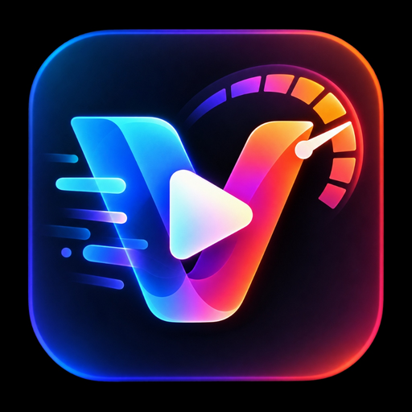

# ⚡ VidAmp: Universal Video Enhancer & Speed Controller

  
  <h2>VidAmp- Universal Video Enhancer & Speed Controller</h2>
  
<strong>The modern video powerhouse for Chrome, Edge, Brave, Firefox, Opera, and Arc.</strong>

  

    
    
    
    
  

  

    <em>Precision touchpad gestures, 1-click speed popover, universal ambient glow, studio bass & vocal boost, frame stepper, smart media downloader, and instant WebM clip exporter.</em>
  

---

## 🌟 Why VidAmp?

**VidAmp** transforms video playback into a modern, cinematic, and effortless experience across the web. Whether you are studying YouTube lectures at **1.4×**, watching films with dynamic **Ambient Glow**, boosting quiet dialogue with **Vocal Clarity**, frame-stepping through action scenes, or downloading videos on generic HTML5 sites, VidAmp puts professional controls right at your fingertips without cluttering the screen.

---

## 🚀 Key Features

### 1. ⚡ Touchpad Gestures & Precision Speed Controller
* **Trackpad Pinch-to-Speed**: Two-finger pinch with deliberate threshold protection so normal page scrolling never accidentally alters your speed.
* **1-Click Speed Popover**: Direct 1-click access to presets: `0.5×`, `0.75×`, `1×`, `1.25×`, `1.4×`, `1.5×`, `1.75×`, `2×`, `2.5×`, `3×`, `4×`.
* **Hold-to-2× with Rate-Guard**: Click & hold to temporarily boost to 2×; releasing immediately restores your exact previous rate (e.g. `1.4×`).
* **Anti-Drift Speed Lock**: Prevents streaming sites (DASH/HLS players) from drifting your playback rate away from your desired speed.

### 2. 🔊 Audio Superpowers (Studio Web Audio EQ)
* **Bass Boost (+7dB Low-Shelf)**: Sub-bass enhancement under 140Hz for movies, action scenes, and music.
* **Vocal Clarity (+6dB Speech Peaking)**: Tuned peaking filter at 2.4kHz specifically optimized for podcasts, tutorials, and dialogue.
* **Volume Boost**: Amplify quiet videos up to 200% safely without distortion using the Web Audio API.

### 3. 🌌 Universal Ambient Glow (Dynamic Bias Lighting)
* Real-time bias lighting aura rendered behind any HTML5 video player.
* Sampled at 32×18 and throttled at 20fps with GPU-accelerated CSS blur (`<0.2ms` GPU frame time) for zero dropped frames and zero CPU lag.
* Toggle with `Shift + A` or from the Below-Video Toolbar.

### 4. ⏱️ Frame-by-Frame Stepper
* Step forward or backward 1 exact frame (~0.033s).
* On-screen badge displays timestamp with millisecond precision (`HH:MM:SS.mmm`).
* Shortcuts: `.` (step forward) and `,` (step backward).

### 5. 🎬 Mini-Clip / WebM Exporter (from A-B Loop)
* Mark Point A and Point B, then export the clip directly to a high-quality `.webm` video download.
* Uses native `MediaRecorder` + `captureStream()`.
* **100% Client-Side**: No external servers, no cloud uploads, completely private.

### 6. 📥 Smart Media Downloader (Generic HTML5 Sites)
* Automatic one-click download for direct `.mp4`, `.webm`, `.ogg`, and `.mov` media files on generic web pages (Vimeo, Reddit, social feeds, news sites, educational portals).
* **Policy Compliant**: Explicitly gates YouTube downloads with a friendly notice to ensure 100% compliance with Chrome Web Store policies.

### 7. 📌 Video Timestamp Bookmarks
* Save key moments with `Shift + B` or the toolbar ribbon.
* Stored persistently per video in `browser.storage.local`.
* Interactive popover lets you jump to timestamps or delete bookmarks with one click.

### 8. 🌙 Sleep Timer (Auto-Pause with Volume Fade)
* Fall asleep watching videos without running them all night.
* Cycles: **15m → 30m → 45m → 60m → End of Video → Off**.
* Gentle 3-second volume fade before pausing. Shortcut: `Shift + S`.

---

## 🎛️ Below-Video Enhancer Toolbar

A sleek translucent obsidian floating bar anchored right below videos covering ≥25% of the screen:

| Icon | Tool | Description |
|:---:|:---|:---|
| 🔁 | **Loop Video** | Toggle continuous single-video loop |
| 🔊 | **Volume Booster** | Amplify volume up to 200% |
| 🎚️ | **Bass & Vocal EQ** | Click: Bass +7dB, Right-Click: Vocal +6dB |
| 🎬 | **Cinema Mode** | Dim page background to spotlight the video |
| 🌌 | **Ambient Glow** | Universal dynamic bias lighting halo |
| 📐 | **Aspect Ratio** | 21:9 ultrawide crop, stretch-to-fill, 16:9 fit |
| ⏱️ | **Speed Pill** | Live speed display + 1-click popover (including 1.4×) |
| ✨ | **Video Filters** | Reset or cycle visual filters (HDR / Contrast) |
| 📸 | **Screenshot** | Instant full-resolution PNG/JPEG frame capture |
| ⚗️ | **A-B Loop** | Set Point A, Point B, and repeat segment |
| 🎬 | **Export Clip** | Save loop segment as a `.webm` video |
| 📥 | **Download Video** | Direct media downloader on HTML5 video sites |
| 📌 | **Bookmarks** | Save and jump between video timestamps |
| 🌙 | **Sleep Timer** | Auto-pause countdown with volume fade |
| ⚙️ | **Video Tools** | Open full floating controller HUD |

---

## ⌨️ Complete Keyboard Shortcuts

| Shortcut | Action |
|:---|:---|
| `Space` | Play / Pause (guaranteed single toggle without repeat) |
| `←` / `→` | Seek backward / forward (configurable 5s, 10s, 15s, 30s) |
| `[` / `]` | Decrease / increase speed snapped to 0.25 grid |
| `.` / `>` | **Step forward 1 frame (~0.033s)** |
| `,` / `<` | **Step backward 1 frame (~0.033s)** |
| `R` | Reset playback speed to `1.0×` |
| `A` | Set Loop Point A |
| `B` | Set Loop Point B |
| `C` | Clear A-B loop points |
| `Shift + B` | **Bookmark current timestamp** |
| `Shift + A` | **Toggle Universal Ambient Glow** |
| `Shift + S` | **Cycle Sleep Timer (15m / 30m / 45m / 60m / End)** |
| `M` | Mute / Unmute audio |
| `P` | Toggle Picture-in-Picture |
| `F` | Toggle fullscreen mode |
| `Shift + ↑` / `Shift + ↓` | Volume up / down (+/- 5%) |
| `Shift + →` / `Shift + ←` | Speed up / down (+/- 0.25×) |
| `Alt + B` | Show / Hide VidAmp floating tools panel |
| `?` | Toggle shortcuts cheatsheet overlay |
| `Esc` | Close cheatsheet or floating panel |

---

## 🌐 Universal Multi-Browser Installation

VidAmp is built on cross-browser Manifest V3 architecture, running natively across all major browsers:

### 1. Google Chrome & Chromium
1. Clone or download this repository.
2. Open `chrome://extensions/` in your browser.
3. Turn on **Developer mode** (toggle in the top-right corner).
4. Click **Load unpacked** and select this project folder.

### 2. Microsoft Edge
1. Open `edge://extensions/`.
2. Enable **Developer mode** in the left sidebar.
3. Click **Load unpacked** and select this project folder.

### 3. Brave Browser
1. Open `brave://extensions/`.
2. Toggle on **Developer mode**.
3. Click **Load unpacked** and select this project folder.

### 4. Mozilla Firefox (v109+)
1. Open `about:debugging#/runtime/this-firefox`.
2. Click **Load Temporary Add-on...**.
3. Select `manifest.json` inside this project folder.

### 5. Arc, Opera & Vivaldi
1. Open your browser's extension management page (`arc://extensions`, `opera://extensions`, or `vivaldi://extensions`).
2. Enable **Developer mode** and select **Load unpacked**.

---

## 🔒 Privacy & Permissions

* **100% Local Execution**: VidAmp runs entirely within your browser. No external API calls, no third-party servers, and zero telemetric tracking.
* **Minimal Permissions**:
  * `storage`: Persists your playback speed, volume, and bookmark preferences locally.
  * `activeTab`: Allows interaction with active video players when triggered.

---

## 📄 License

This project is licensed under the [MIT License](LICENSE) © 2026 Chandan.
